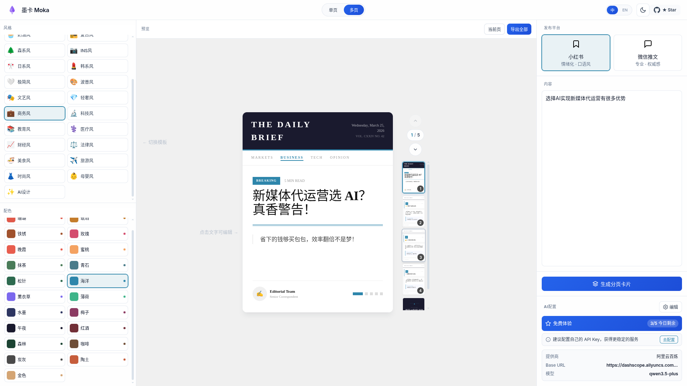

# 墨卡 Moka

AI驱动的爆款文案排版工具，专为小红书、微信公众号等内容创作者设计。

## 功能特性

- 🎨 **29种精美模板**：涵盖杂志风、便签风、极简线、手账风、撞色块、暗夜风、报纸风、胶片风、标签风等经典风格，以及奶油风、复古风、森系风、ins风、日系风、韩系风、极简风、波普风、文艺风、轻奢风等小红书热门风格，还有商务风、科技风、教育风、医疗风、财经风、法律风、美食风、旅游风、时尚风、母婴风等微信公众号专业风格
- 🌈 **8套配色方案**：珊瑚、抹茶、水墨、琥珀、梅子、青石、铁锈、松针
- 🤖 **AI智能生成**：支持 Claude、OpenAI 等多种 LLM 提供商，自动生成结构化排版内容（推荐Claude或者Kimi）
- ✨ **AI设计模式**：上传参考图片，AI 将根据图片风格智能生成独特设计
- ✏️ **实时编辑**：点击文字即可直接编辑，所见即所得
- 🖼️ **高清导出**：支持 2x 高清、4x 超清图片导出
- 📑 **分页模式**：支持多页卡片生成（封面+内容+结尾）
- 🔄 **拖拽排序**：支持段落和卡片拖拽排序
- 📱 **双平台支持**：针对小红书（情绪化、口语风）和微信公众号（专业、权威感）优化

## 界面预览



## 技术栈

- **框架**: React 19 + Vite 6
- **样式**: CSS-in-JS
- **部署**: Cloudflare Pages + Cloudflare Workers
- **图片导出**: html-to-image
- **AI服务**: 支持 Anthropic Claude、OpenAI GPT 等多种 LLM

## 下载安装（推荐）

我们提供桌面客户端，下载到本地使用，无需部署，体验更佳！

### 从 GitHub Releases 下载

访问 [GitHub Releases](https://github.com/renmk/moka/releases) 页面，下载最新版本的安装包：

| 平台 | 安装包类型 | 说明 |
|------|-----------|------|
| **Windows** | `.exe` | 下载 `.exe` 安装程序，一键安装 |
| **Linux** | `.deb` / `.rpm` | Ubuntu/Debian 选 `.deb`，Fedora/RHEL 选 `.rpm` |

### 安装步骤

#### Windows
1. 下载 `墨卡-Moka_x.x.x_x64-setup.exe`
2. 双击运行安装程序
3. 按提示完成安装

#### Linux
**Debian/Ubuntu:**
```bash
sudo dpkg -i moka_x.x.x_amd64.deb
sudo apt-get install -f  # 修复依赖（如有需要）
```

**Fedora/RHEL:**
```bash
sudo dnf install moka-x.x.x-1.x86_64.rpm
```

### 首次使用

1. 启动应用后，点击左下角的「设置」按钮
2. 配置你的 LLM API Key（支持阿里云百炼、OpenAI、Anthropic 等）
3. 开始创作！

> 💡 **提示**: 桌面版支持所有 Web 版功能，且数据保存在本地，更加安全隐私。

## 本地开发

### 环境要求

- Node.js >= 20.0.0
- npm >= 10.0.0

### 安装依赖

```bash
npm install
```

### 启动开发服务器

```bash
npm run dev
```

### 构建生产版本

```bash
npm run build
```

### 预览生产版本

```bash
npm run preview
```

### 代码检查

```bash
npm run lint
```

## 部署

### 部署到 Cloudflare Pages

#### 方法一：通过 Git 集成（推荐）

1. 将代码推送到 GitHub/GitLab 仓库
2. 登录 [Cloudflare Dashboard](https://dash.cloudflare.com)
3. 进入 **Pages** > **Create a project**
4. 选择你的 Git 仓库
5. 配置构建设置：
   - **Build command**: `npm run build`
   - **Build output directory**: `dist`
   - **Root directory**: `/`
6. 点击 **Save and Deploy**

#### 方法二：直接上传

1. 本地构建：`npm run build`
2. 登录 [Cloudflare Dashboard](https://dash.cloudflare.com)
3. 进入 **Pages** > **Create a project** > **Upload assets**
4. 上传 `dist` 文件夹内的所有文件

## 项目结构

```
├── public/                 # 静态资源
│   ├── favicon.svg
│   ├── icons.svg
│   └── logo.svg
├── src/
│   ├── assets/            # 图片资源
│   ├── components/        # 组件
│   │   ├── common/       # 通用组件
│   │   │   ├── DragRow.jsx
│   │   │   ├── EditableEmoji.jsx
│   │   │   ├── EditableText.jsx
│   │   │   ├── Icons.jsx
│   │   │   └── LLMConfigModal.jsx
│   │   ├── layout/       # 布局组件
│   │   │   ├── ContentPanel.jsx
│   │   │   ├── ControlPanel.jsx
│   │   │   ├── EditorLayout.jsx
│   │   │   ├── Header.jsx
│   │   │   ├── PreviewArea.jsx
│   │   │   ├── PreviewPanel.jsx
│   │   │   ├── SettingsPanel.jsx
│   │   │   └── TopBar.jsx
│   │   ├── templates/    # 模板组件
│   │   │   ├── single/   # 单页模板（29种）
│   │   │   │   ├── Editorial.jsx
│   │   │   │   ├── Notecard.jsx
│   │   │   │   ├── Minimal.jsx
│   │   │   │   ├── Artistic.jsx
│   │   │   │   ├── Business.jsx
│   │   │   │   └── ...
│   │   │   └── split/    # 分页模板（26种）
│   │   │       ├── ArtisticStyle.jsx
│   │   │       ├── BusinessStyle.jsx
│   │   │       └── ...
│   │   ├── AIDesignControls.jsx
│   │   ├── AIDesignGenerator.jsx
│   │   ├── AISplitStyleRenderer.jsx
│   │   ├── AIStyleRenderer.jsx
│   │   ├── ReferenceImageUploader.jsx
│   │   └── VersionHistory.jsx
│   ├── constants/         # 常量配置
│   ├── hooks/            # 自定义 Hooks
│   │   ├── useDragReorder.js
│   │   ├── useHtmlToImage.js
│   │   ├── useLanguage.jsx
│   │   └── useTheme.js
│   ├── i18n/             # 国际化
│   │   ├── en.js
│   │   └── zh.js
│   ├── prompts/          # AI Prompts
│   ├── services/         # 服务层
│   ├── utils/            # 工具函数
│   ├── App.jsx           # 主应用
│   ├── App.css           # 全局样式
│   ├── index.css         # 入口样式
│   └── main.jsx          # 入口文件
├── cli/                  # 命令行工具
│   ├── bin/
│   ├── src/
│   ├── README.md
│   └── package.json
├── .env.example          # 环境变量示例
├── .nvmrc                # Node 版本锁定
├── eslint.config.js      # ESLint 配置
├── index.html            # HTML 入口
├── package.json
├── vite.config.js        # Vite 配置
└── wrangler.jsonc        # Wrangler 配置
```

## 模板分类

### 单页模板（29种）

#### 经典风格（9种）
- 杂志风、便签风、极简线、手账风、撞色块、暗夜风、报纸风、胶片风、标签风

#### 小红书热门风格（10种）
- 奶油风、复古风、森系风、ins风、日系风、韩系风、极简风、波普风、文艺风、轻奢风

#### 微信公众号风格（10种）
- 商务风、科技风、教育风、医疗风、财经风、法律风、美食风、旅游风、时尚风、母婴风

### 分页模板（26种）

支持封面页、内容页、结尾页的分页设计，包含上述大部分风格的对应分页版本。

## 使用说明

### API 配置

首次使用时，系统会弹出 API 配置弹窗，你需要配置 LLM 服务：

1. **选择提供商**：支持 OpenAI、Anthropic、阿里云百炼等
2. **配置 API Key**：输入你的 API 密钥
3. **设置 API 地址**：系统会自动填充默认地址，也可自定义
4. **选择模型**：选择要使用的模型（如 qwen-plus、gpt-4o-mini 等）

配置会自动保存在浏览器本地存储中，下次使用无需重复配置。

### 基础使用

1. 完成 API 配置后，在左侧输入框中粘贴你的文案或话题
2. 选择模板风格（单页版）或卡片风格（分页版）
3. 选择配色方案
4. 点击「生成排版图」或「生成分页卡片」
5. 在预览区域查看生成的排版
6. 点击文字可直接编辑
7. 点击导出按钮下载高清图片

### AI设计模式

1. 选择「AI设计」模板
2. （可选）上传参考图片，AI 将参考图片风格
3. 输入文案内容
4. 点击生成，AI 将自动设计独特的排版风格
5. 支持版本历史，可回溯查看之前的设计

### 分页模式

1. 切换到「分页版」模式
2. 选择发布平台（小红书/微信推文）
3. 选择卡片风格
4. 输入文案，AI 将自动生成封面、内容页、结尾页
5. 支持拖拽排序调整页面顺序
6. 可单独导出当前页或一次性导出全部

## 注意事项

1. **API Key 安全**: API 密钥存储在浏览器本地存储中，请勿在公共设备上使用
2. **图片导出**: 使用 html-to-image 生成高清图片
3. **浏览器兼容**: 推荐使用 Chrome、Edge、Safari 最新版本
4. **移动端**: 支持移动端浏览器访问，但建议使用桌面端获得最佳编辑体验

## 许可证

MIT License
